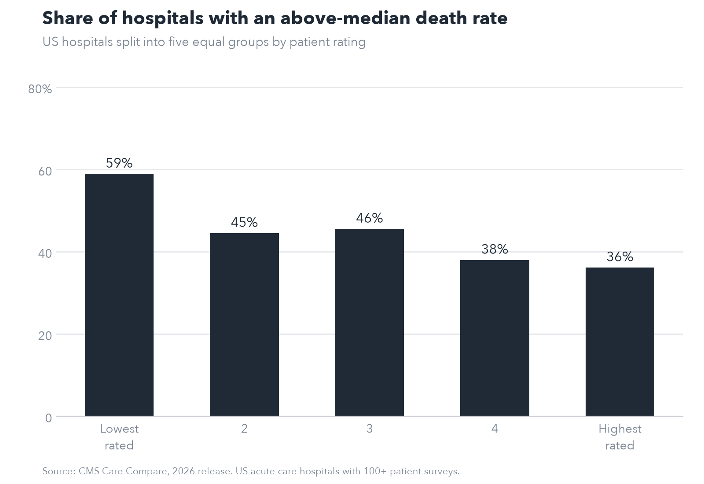
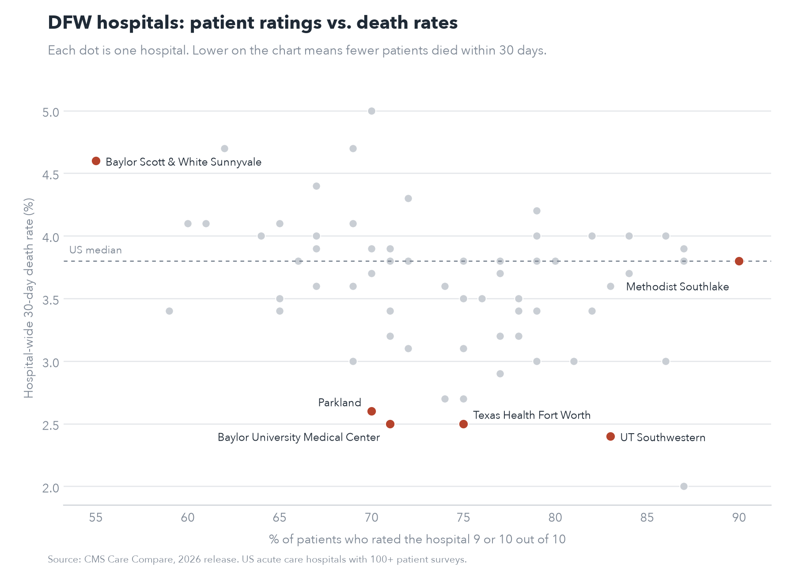
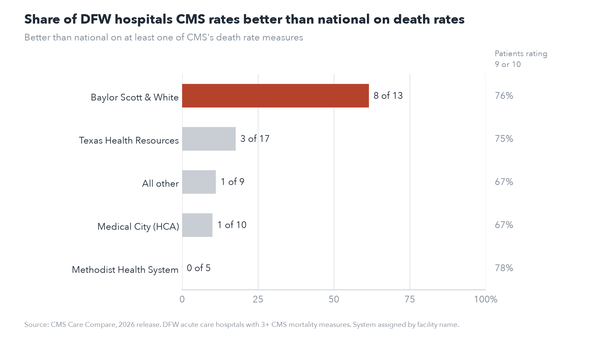

# DFW hospital patient ratings vs. death rates
Primary Research Question: I wanted to know if the hospitals patients rate the highest are actually the ones where patients do better. Patient ratings are the easy thing to find when you look up a hospital. Death rates and readmission rates are public too but most dont look at them. 

I used CMS Care Compare data for every acute care hospital in the US and then looked at the Dallas Fort Worth area specifically.

## Findings

Higher rated hospitals do have somewhat lower death rates, but it's not a strong pattern. I split about 2,700 hospitals into five groups by patient rating. In the lowest rated group, 59% of hospitals had a death rate above the national median. In the highest rated group it was 36%. So a top rated hospital is a better bet, but more than a third of them are still above the median.

The actual death rates aren't that far apart either. 4.1% on average in the lowest rated group and 3.7% in the highest.

Heart failure readmissions came out almost the same (60% vs 37%).



In DFW the hospitals at the top of the patient ratings are mostly specialty hospitals. 8 of the top 13 have heart, surgery or orthopedic in the name. A lot of their patients are coming in for planned procedures and aren't as sick, so that probably helps their ratings.

Also DFW patients just rate their hospitals higher than the rest of the country. 49 of the 67 DFW hospitals were above the national median.



## Death rates by DFW health system

I also compared the hospital wide death rate to CMS's other death rate measures (heart attack, heart failure, pneumonia, COPD, stroke, bypass surgery and a couple others, up to 8 per hospital). For those, CMS says whether each hospital is better, no different or worse than national. The two mostly agree. Hospitals rated better on at least one of those measures average 3.1% on the hospital wide rate and hospitals rated worse average 4.4%. But 66% of hospitals are rated "no different" on every single one, so those ratings don't separate most hospitals at all.

In DFW, Baylor Scott & White stands out. 8 of its 13 hospitals are rated better than national on at least one death rate measure. Texas Health Resources is 3 of 17, Medical City is 1 of 10 and Methodist is 0 of 5. Only one DFW hospital, Texas Health Harris Methodist Fort Worth, had a measure rated worse, and it also had one rated better.

Methodist's patients actually gave it the highest ratings of any system (78% rating it a 9 or 10), but none of its hospitals were rated better on death rates.

It's easier for a big hospital to get rated better since more patients means a tighter estimate, so I checked whether Baylor's hospitals were just bigger. They aren't. Their median is about 2,240 patients compared to about 2,490 for Medical City and 2,820 for Methodist. Looking only at the bigger half of DFW hospitals, Baylor is still 7 of 8.



## Data

From [CMS Care Compare](https://data.cms.gov/provider-data/topics/hospitals), 2026 release. I used four files:

- Hospital General Information
- Patient survey (HCAHPS) - Hospital
- Complications and Deaths - Hospital
- Unplanned Hospital Visits - Hospital

## Process

I only kept regular acute care hospitals. The data also has critical access hospitals (small rural ones), VA and military hospitals, psych and children's hospitals, and those aren't comparable.

For the patient rating I used the % of patients who rated the hospital a 9 or 10 out of 10. I dropped hospitals with fewer than 100 surveys 

For outcomes I used the hospital wide 30 day death rate and the heart failure 30 day readmission rate. Both are risk adjusted by CMS. I wanted to use the hospital wide readmission rate to match the death rate, but it was blank for every hospital in this release. I also dropped any hospital CMS marked as having too few cases.

For the health system comparison I used the counts of better, no different and worse mortality measures from the Hospital General Information file, and only included hospitals with at least 3 of those measures. A hospital counts as rated better if at least one measure is better than national. Hospital size is the number of patients in the hospital wide death rate measure.

DFW is the 11 counties the Census Bureau counts in the Dallas Fort Worth metro: Collin, Dallas, Denton, Ellis, Hunt, Johnson, Kaufman, Parker, Rockwall, Tarrant and Wise.

I ran the main comparison on the whole country instead of just DFW. Only 67 DFW hospitals had both numbers, and that's too small to tell if a pattern is real.

## Notes

Risk adjustment isn't perfect, especially for hospitals that get a lot of very sick transfers. The ratings and outcomes also cover slightly different time periods. This only shows the two are related, not why.

Heart failure readmission rates are really close together across hospitals (most are between 20.6% and 22.1%) so I wouldn't read much into small differences there.

The hospital wide death rate is a newer CMS measure and this release doesn't include a confidence interval or a better/worse rating for it, so I don't compare individual hospitals on it alone.

Health systems are assigned from the facility name, so joint ventures and recently acquired hospitals might not be grouped exactly right.

## Running it

```bash
git clone https://github.com/Savannahwilcox/dfw-hospital-quality.git
cd dfw-hospital-quality
python3 -m venv venv
source venv/bin/activate
pip install -r requirements.txt
```

Download the four files from CMS into `data/raw/`, then run the scripts in order:

```bash
python scripts/02_patient_survey.py
python scripts/03_outcomes.py
python scripts/04_combine.py
python scripts/05_analysis.py
python scripts/06_dfw.py
python scripts/07_charts.py
python scripts/08_mortality_measures.py
python scripts/09_system_chart.py
```

Built with Python, pandas and matplotlib